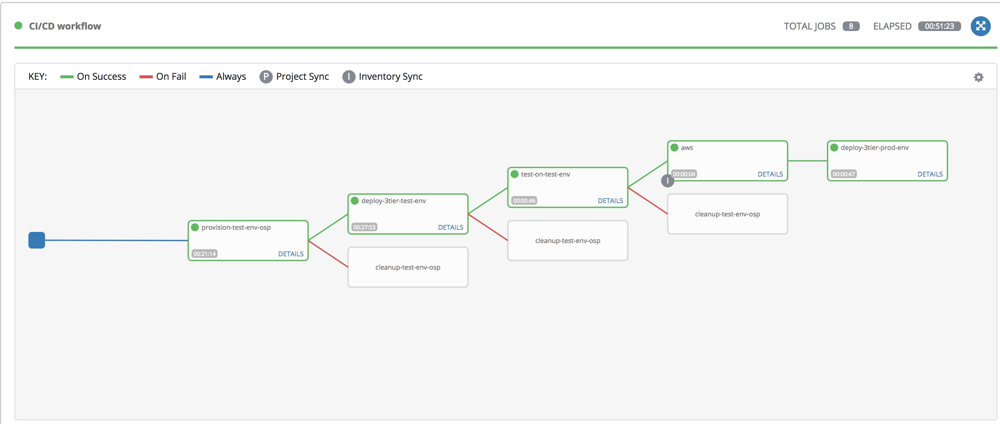

= Playbook for Ansible Advanced Training

Playbooks used to implement CI/CD workflow with Ansible Tower.

.CI/CD workflow

== Ansible Playbooks used here

-- ansible.cfg:: used for overwrite ssh options.

-- ssh.cfg:: customized ssh options due to using jumpbox to access real host in cloud environment.

-- provision-test-env-osp.yml:: Provision 4 server instances on openstack.

-- deploy-3tier-test-env.yml:: Deploy 3 tier(web/app/db) application to above 4 instances on openstack.

-- test-on-test-env.yml:: Run Smoke test for 3 tier application.

-- cleanup-test-env-osp.yml:: Cleanup our test environment by delete all server instance, which is supposed to be on an openstack environment.

-- deploy-3tier-prod-env.yml:: If above PB succeed, deploy 3 tier application to an pre-provisioned AWS environment.

-- cleanup-3tier-prod-env.yml:: Cleanup our AWS environment by remove packages from AWS servers.

-- roles:: Ansible roles we used in this demo.

== Ansible Tower settings

See link:./screenshot[screenshot] for the settings for Credential, Inventory, Job Template.
